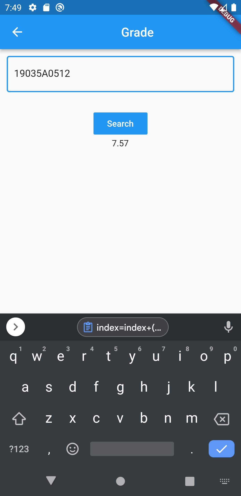

# studentcorner

A new Flutter project.

## Getting Started

This project is a student corner application that can make students track all their academic aspects in it.

1. Academic Grade Cards  
2. Academic Calendar 
3. Time Table 
4. Attendence 

 
Screenshot of Grading :
 

